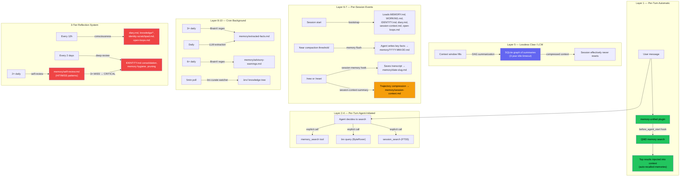

# Optimized Claw

<p align="center">
    
</p>

<p align="center">
  <strong>Production-hardened OpenClaw for multi-agent teams</strong>
</p>

<p align="center">
  <a href="LICENSE"></a>
  
  <a href="https://github.com/openclaw/openclaw"></a>
  <a href="https://openclawservers.com"></a>
</p>

---

## What is Optimized Claw?

**Optimized Claw** is a production-hardened fork of [OpenClaw](https://github.com/openclaw/openclaw) — the open-source personal AI assistant. It tracks upstream closely but ships battle-tested fixes, multi-agent structure, security hardening, and infrastructure improvements needed to run OpenClaw reliably in production with multiple agents.

Everything from upstream works as-is. Optimized Claw adds the layer on top: per-agent browser containers, autonomous consciousness loops, content security, a deep memory stack, autonomous health monitoring with self-healing playbooks, cron defense with agent-driven remediation, per-turn alignment drift scoring, automated memory maintenance, bundled search and stealth scraping sidecars (SearXNG + Scrapling), Docker reliability fixes, and tooling that makes multi-agent deployments actually stable.

If you want a single-agent personal assistant, upstream OpenClaw is great. If you want to run a **team of agents** on a server, keeping them secure, self-aware, and structured for multi-agent operation — this fork is for you.

The public brand is **Optimized Claw**, but the runtime, CLI, package layout, and config paths stay `openclaw` for upstream compatibility.

---

## Best Fit

Optimized Claw is a better fit than stock upstream if you are:

- running multiple long-lived agents on one gateway
- deploying primarily with Docker or server-hosted infrastructure
- relying on per-agent browser isolation and scoped credentials
- wanting agents that autonomously self-improve, reflect, and maintain their own memory
- using upstream channels like Matrix/Element, Telegram, Discord, Slack, or WhatsApp but wanting a more production-oriented baseline
- keeping a fork in sync with upstream while preserving a known patch set

---

## Minimum Requirements

| Resource | Minimum                                                       |
| -------- | ------------------------------------------------------------- |
| RAM      | 8 GB                                                          |
| CPU      | 4 cores                                                       |
| Disk     | 20 GB (Docker images + workspace data)                        |
| OS       | Linux (Ubuntu 22.04+), macOS 13+, Windows 11 (Docker Desktop) |

This is a full-featured fork with a deep memory stack, browser containers, search/scraping sidecars, and autonomous cron jobs — it's a beefy boi. Budget accordingly.

---

## What's Different from Upstream OpenClaw?

### 🔒 Security

| Feature                    | Description                                                                                                                                                                                                                                                                                                                                                                            |
| -------------------------- | -------------------------------------------------------------------------------------------------------------------------------------------------------------------------------------------------------------------------------------------------------------------------------------------------------------------------------------------------------------------------------------- |
| [ACIP](ACIP_SECURITY.md)   | Advanced Cognitive Inoculation Prompt — baked into every agent. Defends against prompt injection, data exfiltration, and instruction manipulation across all external content and tool outputs                                                                                                                                                                                         |
| Content Scanner            | Automatic content scanning with risk scoring on all external inputs (browser, web-fetch, cron). Scans everything agents touch from the outside world                                                                                                                                                                                                                                   |
| Workspace Context Scanning | Bootstrap files (SOUL.md, IDENTITY.md, etc.) are scanned for prompt injection before entering the system prompt. Quarantined content is wrapped with ACIP boundary markers. Fail-open design                                                                                                                                                                                           |
| Data Classification        | Three-tier classification (Confidential / Internal / Public) with PII detection and precomputed regex patterns for performance                                                                                                                                                                                                                                                         |
| Event Logger               | Structured JSONL event logging with PII redaction, log rotation, and queryable history                                                                                                                                                                                                                                                                                                 |
| AgentGuard                 | Inspired by SkillGuard — three-part safety system: (1) secret redaction (14 regex patterns detect API keys, tokens, PEM keys in agent output — redacted before channel delivery), (2) security event journal (append-only JSONL for secret/injection/quarantine/audit events), (3) OC deployment audit (6 checks for SearXNG exposure, sandbox leaks, gateway auth, resource warnings) |
| Prompt Guard Skill         | Teaches agents to detect and handle prompt injection using the existing ACIP scanner — risk scoring, quarantine handling, boundary markers                                                                                                                                                                                                                                             |
| ClawScan Skill             | Teaches agents to run comprehensive security sweeps across workspaces, skills, dependencies, and configurations using existing scanners and CLI tools                                                                                                                                                                                                                                  |

### 🤖 Multi-Agent Architecture

| Feature                          | Description                                                                                                                                                                                                                                                                                                                                                                                                                          |
| -------------------------------- | ------------------------------------------------------------------------------------------------------------------------------------------------------------------------------------------------------------------------------------------------------------------------------------------------------------------------------------------------------------------------------------------------------------------------------------ |
| Structured Agent Workspaces      | Each agent gets a purpose-built directory layout (`memory/`, `knowledge/`, `skills/`, `docs/`, `downloads/`, `diary.md`, `open-loops.md`, `IDENTITY.md`, etc.) seeded automatically at creation — no manual setup required                                                                                                                                                                                                           |
| **Full Tool Profile by Default** | All agents default to `tools.profile = "full"` — no arbitrary tool restrictions. The previous `"coding"` profile silently blocked browser, canvas, nodes, and agents_list. This is enforced on every gateway restart, so stale narrow profiles are automatically corrected                                                                                                                                                           |
| Per-Agent Browser Containers     | Each agent gets a **dedicated, persistent browser container** via Docker — not a shared browser. State (cookies, sessions, localStorage) persists across restarts. Supports both CDP (Playwright) and **Chrome MCP** transport. noVNC built in — you can manually log into any agent's browser via `http://your-server/sbx-browser/<agentId>/` to watch them work, pre-authenticate sessions, or scroll social media on their behalf |
| Per-Agent OAuth                  | Removed credential inheritance — agents use only their own OAuth tokens                                                                                                                                                                                                                                                                                                                                                              |
| Autonomous Self-Improvement      | Each agent runs its own consciousness loop, self-review, deep review, and nightly innovation — standalone by default, not relying on external orchestration                                                                                                                                                                                                                                                                          |
| Pre-Seeded Cron Jobs             | 17 default cron jobs seeded per agent — see [Pre-Seeded Cron Jobs](#pre-seeded-cron-jobs) below for the full list. `MAIN_ONLY_JOBS` filtering ensures sub-agents skip platform-level tasks                                                                                                                                                                                                                                           |
| Browser-Only Sandbox Mode        | `browser-only` sandbox mode for agents that need browser access without full containers                                                                                                                                                                                                                                                                                                                                              |
| Agent Browser Routing            | `createBrowserTool()` passes `agentId` so agents route to their own containers                                                                                                                                                                                                                                                                                                                                                       |
| Per-Agent CLI Onboarding         | `--agent` and `--sync-all` flags for scoped credential setup _(upstream feature)_                                                                                                                                                                                                                                                                                                                                                    |
| Self-Delegation Guidance         | Agents taught when and how to break their own work into focused subtasks via `sessions_spawn`, keeping context clean across independent workstreams                                                                                                                                                                                                                                                                                  |

### 🧠 Consciousness & Memory — The 10-Layer Memory Stack

This fork has a significantly deeper memory stack than upstream. Rather than treating each session as isolated, agents carry context forward across resets — and actively reflect on their own behavior. The system has **10 distinct memory layers** across 4 categories, each firing at different times.

#### How It All Fits Together



#### Layer 1: Auto-Recall — Memory-Unified Plugin _(per-turn, automatic)_

**The newest layer.** The `memory-unified` plugin hooks into `before_agent_start` and automatically searches memory on every user turn. Results are injected as `<auto-recalled-memories>` XML tags via `prependContext` — no agent action needed.

This replaced the old approach where agents had to remember to call `memory_search` themselves (they often didn't).

| Setting            | Default | Description                 |
| ------------------ | ------- | --------------------------- |
| `autoRecall`       | `true`  | Enable per-turn auto-recall |
| `recallMaxResults` | `5`     | Max memories to inject      |
| `recallMinScore`   | `0.3`   | Minimum relevance threshold |

**Guards** (auto-recall is skipped for): prompts < 10 chars, cron/heartbeat/memory triggers, slash commands starting with `/`, missing session keys.

**Tiered injection limits:** `maxInjectedChars` is **5,000** in normal mode and **10,000** in business mode (controlled by `OPENCLAW_BUSINESS_MODE`).

#### Layer 2: QMD Memory Backend _(per-turn, on-demand)_

**What:** Hybrid BM25 + vector search over all workspace `.md` files — MEMORY.md, `memory/*.md`, diary, business docs, knowledge topics. Always-on by default (opt-out via `OPENCLAW_QMD_ENABLED=false`).

**Features:**

- Hybrid scoring: 70% vector / 30% BM25 text overlap
- Temporal decay: 14-day half-life (recent memories rank higher)
- [MiroFish](https://github.com/666ghj/MiroFish)-inspired source-boost: 1.15× boost for knowledge files (`MEMORY.md`, `memory/*.md`, `memory/knowledge/*.md`, `IDENTITY.md`, `WORKING.md`)
- Multimodal support (images/audio via Gemini — optional)
- Session transcript indexing (conversations are searchable too)

**When:** Auto-recall (Layer 1) uses this backend automatically. Agents can also call `memory_search` manually for targeted queries.

#### Layer 3: ByteRover _(per-turn agent-initiated + background curation)_

**What:** Local-first knowledge curation via **Gemini Flash Lite**. Maintains a private knowledge tree (`.brv/`) with curated facts extracted from key files.

**Agent-facing:** `brv query "topic"` — retrieval from the curated tree.

**Background curation:** `brv-curate-watcher.sh` runs as a daemon, polling every 5min. Hash-based — only re-curates when files actually change. Watches:

| Source                                                     | Type                           |
| ---------------------------------------------------------- | ------------------------------ |
| `MEMORY.md`, `USER.md`, `IDENTITY.md`, `SOUL.md`           | Fixed identity files           |
| `memory/extracted-facts.md`, `memory/advisory-warnings.md` | BrainX outputs                 |
| `memory/identity-scratchpad.md`                            | Identity evolution             |
| `diary/*.md`                                               | All diary files (dynamic)      |
| `memory/knowledge/*.md`                                    | Knowledge topics (dynamic)     |
| Yesterday's `memory/YYYY-MM-DD.md`                         | Previous day's memory (stable) |

#### Layer 4: Session Search _(per-turn, agent-initiated)_

**What:** FTS5-powered keyword search across all past conversations stored in `memory/sessions.db`.

**Features:** [OpenViking](https://github.com/volcengine/OpenViking)-inspired hotness scoring (access count + recency decay blended with FTS5 rank), mechanical query rewriting (OR-expansion), sub-agent session isolation.

**When:** Agent calls `session_search` tool — complements the embedding-based `memory_search` with exact keyword lookup.

#### Layer 5: Lossless Claw (LCM) _(session lifecycle)_

**What:** [DAG-based conversation memory](https://github.com/martian-engineering/lossless-claw) that replaces the default sliding-window compaction. Context is preserved as a graph of summaries in SQLite — sessions effectively never reset (3-year idle timeout).

**How:** Instead of throwing away old messages when the context window fills up, LCM summarizes conversation segments into a directed acyclic graph. Each new summary links to its predecessors, so the agent retains the full thread of context in compressed form. Pre-baked into the Docker image — no runtime install needed.

#### Layer 6: Memory Flush _(pre-compaction)_

**What:** When the context window nears compaction threshold, injects a "flush turn" telling the agent to write important context to `memory/YYYY-MM-DD.md` before the window compacts.

**Triggers:** `totalTokens > contextWindow - 55000 - 8000` or transcript size > 2MB.

**Why:** Even with LCM, some context is better preserved as explicit memory entries rather than summaries. The flush ensures critical facts survive compaction in full fidelity.

#### Layer 7: Session-Memory Hook _(session reset)_

**What:** When a user runs `/new` or `/reset`, saves the last 15 messages as a dated memory file with an LLM-generated slug (e.g., `2026-03-17-deploy-fix.md`).

**Also:** `session-context-summary.ts` runs trajectory compression on every session — first/last turns preserved verbatim, middle compressed via key decisions, tool usage, and user intents. Written to `memory/session-context.md` for next-session boot.

#### Layer 8: BrainX Fact Extractor _(cron, 3× daily)_

**What:** Regex-based fact extraction from session transcripts. Scans for URLs, GitHub repos, port numbers, environment variables, service names, API endpoints.

**Output:** `memory/extracted-facts.md` (deduplicated, max 16K chars). No LLM — pure regex, fast and deterministic.

**Schedule:** 01:00, 09:00, 17:00 UTC.

#### Layer 9: BrainX Advisory Warnings _(cron, 6× daily)_

**What:** Scans diary + memory files for failure patterns — deploy crashes, dangerous commands, auth errors, OOM, rate limits.

**Output:** `memory/advisory-warnings.md` (severity-sorted, max 4K chars). No LLM — pure regex.

**Schedule:** Odd hours (03, 07, 11, 15, 19, 23 UTC).

#### Layer 10: Memory Extraction _(cron, daily)_

**What:** LLM-powered semantic extraction from recent non-cron conversations. [OpenViking](https://github.com/volcengine/OpenViking)-inspired 5-category system: `[preference]`, `[fact]`, `[entity]`, `[decision]`, `[open]`.

**Output:** Appended to `memory/extracted-facts.md` with date headers. Deduplicates against existing `extracted-facts.md` and `MEMORY.md`. Consolidates and prunes when the file exceeds 200 lines.

**Schedule:** Daily at 10:00 UTC.

#### The 3-Tier Reflection System

On top of the memory stack, three autonomous reflection jobs continuously refine the agent's self-model:

| Job               | Schedule                | What it does                                                                                                   |
| ----------------- | ----------------------- | -------------------------------------------------------------------------------------------------------------- |
| **Self-Review**   | 2× daily (06:00, 18:00) | Pattern tracker — logs HIT/MISS entries, promotes 3× MISSes to CRITICAL rules in IDENTITY.md                   |
| **Consciousness** | Every 12h (dynamic)     | Free-form reflection — diary writes, knowledge updates, identity evolution. Adjusts own wake interval (4h–12h) |
| **Deep Review**   | Every 2 days (04:00)    | Full 48h audit — identity consolidation, memory hygiene, knowledge pruning, semantic consistency               |

The result: agents remember what they did, learn from their patterns, carry forward across resets, and continuously evolve their own identity.

#### Additional Memory Features

| Feature                       | Description                                                                                                                                                                                                    |
| ----------------------------- | -------------------------------------------------------------------------------------------------------------------------------------------------------------------------------------------------------------- |
| Tool Usage Statistics         | [OpenViking](https://github.com/volcengine/OpenViking)-inspired per-tool tracking — call counts, success/failure rates, durations. Stored in shared `sessions.db`                                              |
| Skill Auto-Creation           | Agents create and manage their own skill documents autonomously in `workspace/skills/`                                                                                                                         |
| Skill Evolution               | Weekly cron generates `SKILL.md` files from recurring failure patterns — inspired by [MetaClaw](https://github.com/aiming-lab/MetaClaw). Generation-versioned for cache invalidation                           |
| Skill Generation Versioning   | Monotonically increasing counter in `skills/.generation.json` — skills tagged on creation, bumped after evolution runs. Enables cache invalidation when skills evolve                                          |
| Per-Session Skill Candidates  | Zero-cost mechanical extraction from session transcripts on reset — detects multi-step tool workflows (3+ tools) and iterative correction patterns. Stored in `memory/skill-candidates.md` for evolution cron  |
| Progressive Disclosure Skills | Token-efficient skill indexing — compact index in system prompt, full SKILL.md loaded on demand via `skill_view`. [Hermes Agent](https://github.com/NousResearch/hermes-agent)-inspired. ~50-60% token savings |
| Alignment Drift Scoring       | Per-turn identity compliance check via Flash Lite (~$0.00008/check). Scores each response against SOUL.md + IDENTITY.md rules, injects corrective context when drift detected. Cooldown + escalation logic     |
| Knowledge Base Indexer        | Auto-scans `memory/knowledge/*.md` and builds a queryable `_index.md`                                                                                                                                          |
| Improvement Backlog           | Structured backlog with tiered triage (auto-implement / build-then-approve / propose-only)                                                                                                                     |
| Nightly Innovation            | 5-phase autonomous building cron (2 AM) with backlog integration                                                                                                                                               |
| Morning Briefing              | Personalized daily summary (8 AM) with backlog surfacing and Standing Corrections                                                                                                                              |
| Diary Archival & Continuity   | Automatic diary rotation with continuity summaries across archive boundaries                                                                                                                                   |
| Auto-Tidy                     | Scheduled workspace cleanup — prunes stale entries from MEMORY.md, open-loops, self-review, session-context, backlog, and BrainX files                                                                         |
| Slash Commands                | `/fresh` (clear context), `/forget [topic]` (delete memories), `/remember [topic]` (inject specific memories)                                                                                                  |

### ⏰ Pre-Seeded Cron Jobs

Every agent is automatically provisioned with **18 cron jobs** covering reflection, maintenance, memory enrichment, autonomous building, and self-healing. These are seeded at agent creation via `enforce-config.mjs cron-seed` and can be customized per agent.

Some jobs are **main-agent only** (`MAIN_ONLY_JOBS`) — sub-agents get the core set without duplicating platform-level tasks like backups or global fact extraction. Heavy reflection jobs (consciousness, deep-review, skill-evolution, nightly-innovation) use **idle-aware scheduling** — deferred when the user is actively chatting, running during idle windows or the sleep window (23:00–07:00 UTC).

| Job                          | Schedule                          | What It Does                                                                                                                                                              |
| ---------------------------- | --------------------------------- | ------------------------------------------------------------------------------------------------------------------------------------------------------------------------- |
| `self-review`                | 06:00 + 18:00 UTC                 | Pattern tracker — logs HIT/MISS entries from recent sessions, counts occurrences, promotes 3× MISSes to CRITICAL rules in IDENTITY.md                                     |
| `consciousness`              | Every 12h (dynamic via NEXT_WAKE) | Natural reflection loop — diary writes, knowledge updates, identity evolution, open-loop review. Dynamically adjusts its own interval (4h–12h) based on activity level    |
| `deep-review`                | Every 2 days at 04:00 UTC         | Comprehensive 48h audit — identity consolidation, memory hygiene, knowledge pruning, over-correction detection, semantic consistency check                                |
| `skill-evolution`            | Weekly (+6h offset)               | Reviews self-review MISS patterns and generates reusable `SKILL.md` files from recurring failures. Also revises existing skills flagged with SKILL-GAP entries            |
| `nightly-innovation`         | Daily at 02:00 UTC                | 5-phase autonomous building session — reads the improvement backlog, builds approved items, creates follow-up cron jobs for multi-step work, logs proposals               |
| `morning-briefing`           | Daily at 08:00 UTC                | Personalized daily summary delivered to the user's chat channel — reviews all context files, overnight innovation results, backlog status, open loops                     |
| `self-audit-21`              | Sunday 23:00 UTC                  | Weekly 21-question strategic audit covering capabilities, blind spots, pattern recognition, context gaps, self-improvement, and strategy. Feeds the improvement backlog   |
| `auto-tidy`                  | Every 72h                         | Workspace maintenance — prunes stale entries from WORKING.md, MEMORY.md, open-loops, self-review, session-context, backlog, and BrainX files                              |
| `diary-post-archive`         | Every 14 days                     | Writes a continuity summary after the deterministic diary archiver rotates `diary.md`. Ensures new diary period has context from the previous one                         |
| `browser-cleanup`            | Daily at 14:00 UTC                | Closes stale browser tabs to prevent resource exhaustion (enabled only when browser containers are active)                                                                |
| `brainx-extract-facts`       | 3× daily (01:00, 09:00, 17:00)    | Regex-based fact extraction from session transcripts — URLs, repos, ports, env vars, services → `memory/extracted-facts.md`                                               |
| `brainx-advisory-warnings`   | 6× daily (odd hours)              | Failure pattern scanner — detects deploy failures, dangerous commands, auth errors in memory files → `memory/advisory-warnings.md`                                        |
| `memory-extraction`          | Daily at 10:00 UTC                | LLM-powered semantic fact extraction — 5 categories (`[preference]`, `[fact]`, `[entity]`, `[decision]`, `[open]`) with deduplication                                     |
| `healthcheck-update-status`  | Weekly (Monday 07:00)             | Checks for OpenClaw updates via `openclaw update status`                                                                                                                  |
| `healthcheck-security-audit` | Weekly (+4h offset)               | Deployment security audit — SearXNG exposure, sandbox leaks, gateway auth, resource warnings (community deployments only)                                                 |
| `openclaw-backup`            | Every 12h                         | Automatic config backup to Supabase Storage (managed platform only, disabled by default)                                                                                  |
| `workspace-doc-converter`    | Hourly (disabled by default)      | Converts PDF/DOCX/ODT/CSV/EPUB files to markdown for QMD indexing — the background sidecar handles this automatically, cron is for forced passes                          |
| `system-health-check`        | Every 6h (isolated session)       | Auto-seeded system job that prompts the agent to run `cron_heal diagnose` — identifies failing/disabled/stale jobs and applies automated fixes. Gated by `seedSystemJobs` |

#### 🔍 Reflection Jobs

**`self-review`** — The pattern tracker. Twice daily, this job reads the reflection inbox, recent session transcripts, and WORKING.md to identify concrete behaviors worth logging. It writes HIT (things that went well) and MISS (mistakes, missed opportunities) entries to `memory/self-review.md` in a structured table format with dates, recurrence counts, and associated skills. When a MISS pattern hits 3+ occurrences, it's **mandatory** to promote the fix to a CRITICAL rule in `IDENTITY.md`. Also cross-references against existing skills — if a skill exists but wasn't used, it logs a `MISS-SKILL` entry; if it was used but didn't help, a `SKILL-GAP` entry.

**`consciousness`** — The natural reflection loop. This is the agent's "thinking time" — diary writes, knowledge updates, identity evolution, and open-loop review. Unlike the mechanical `self-review`, consciousness is more free-form: the agent reflects on what happened, what patterns are emerging, and what it's becoming. It dynamically adjusts its own wake interval via `NEXT_WAKE` (4h when lots is happening, 12h when quiet). Writes to `diary.md`, `knowledge/`, `open-loops.md`, and optionally `IDENTITY.md`. Has strict anti-waste rules — if nothing meaningful changed, it responds `HEARTBEAT_OK` instead of churning.

**`deep-review`** — The comprehensive 48-hour audit. Every 2 days, this job reads everything — IDENTITY.md, MEMORY.md, all knowledge files, self-review patterns, diary entries, session transcripts. It consolidates identity rules (merging duplicates, removing contradictions), prunes knowledge files, checks for over-correction (when a FIX for one problem creates a new one), and validates semantic consistency across the agent's entire self-model. This is where major identity evolution happens.

**`self-audit-21`** — The weekly strategic self-assessment. 21 questions across 7 categories (capabilities, assumptions, pattern recognition, context gaps, self-improvement, strategy, meta). Forces the agent to surface insights it would never generate unprompted — blind spots about the user, underutilized knowledge, compounding investments, workflow automations. Findings are triaged into 3 tiers: 🟢 auto-implement, 🟡 build-then-approve, 🔴 propose-only, and fed into the improvement backlog.

**`skill-evolution`** — The weekly skill generator. Reviews self-review MISS patterns with 3+ occurrences and determines whether each is a behavioral rule (→ IDENTITY.md) or a procedural skill (→ new `SKILL.md`). Also reviews existing skills flagged with `SKILL-GAP` entries and rewrites sections that didn't prevent failures. Max 2 new skills or revisions per run.

#### 🛠️ Building & Delivery Jobs

**`nightly-innovation`** — The overnight building session (2 AM). A 5-phase autonomous cycle: gather context → decide what to build → build it → update the backlog → log results. Priority order: approved backlog items first, then user requests, then recurring failure fixes, then self-motivated projects. Has strict anti-busywork rules — if nothing needs building, it stops. Can create one-shot follow-up cron jobs for multi-step work. Never takes irreversible actions without approval.

**`morning-briefing`** — The daily personalized summary (8 AM), delivered directly to the user's chat channel. Reviews all 11 context sources (MEMORY.md, WORKING.md, open-loops, diary, self-review, knowledge base, IDENTITY.md, recent sessions, workspace state, cron run history, improvement backlog). Adapts tone to the user's communication style. Applies standing corrections from previous feedback. On Mondays, includes the weekly self-audit findings. Correction-aware — if the user told the agent to stop mentioning something, it checks before including it.

#### 🧠 Memory Enrichment Jobs

**`brainx-extract-facts`** — Regex-based fact extraction running 3× daily. Scans session transcripts for structured data patterns (URLs, GitHub repos, port numbers, environment variables, service names, API endpoints) and writes them to `memory/extracted-facts.md`. Fast and deterministic — runs a Node.js script, not an LLM call. Caps at 16K characters.

**`brainx-advisory-warnings`** — Failure pattern scanner running 6× daily at odd hours. Scans diary and memory files for warning patterns (deployment failures, dangerous commands, authentication errors, resource exhaustion signals) and generates severity-sorted warnings in `memory/advisory-warnings.md`. Also deterministic — script-based, not LLM. Caps at 4K characters.

**`memory-extraction`** — LLM-powered semantic extraction running daily at 10:00 UTC. Complements the regex-based BrainX jobs with deeper understanding. Reads recent non-cron session transcripts and extracts facts into 5 structured categories: `[preference]`, `[fact]`, `[entity]`, `[decision]`, `[open]`. Deduplicates against both existing `extracted-facts.md` and `MEMORY.md` before writing. Consolidates and prunes when the file exceeds 200 lines.

#### 🧹 Maintenance Jobs

**`auto-tidy`** — Workspace cleanup running every 72 hours. Two phases: (1) file organization — orphaned files sorted into domain folders, stale/duplicates cleaned up, archive structure maintained; (2) content hygiene — mechanical cleanup of WORKING.md (40 line cap), self-review.md (30-day retention), open-loops.md (14-day stale detection), session-context.md (20K char cap), MEMORY.md (150 line cap), improvement backlog (archive completed items), and BrainX files. Results logged to `tidy-history/`.

**`diary-post-archive`** — Runs every 14 days after the deterministic diary archiver rotates `diary.md`. Reads the archived diary in full, then writes a synthesized continuity summary into the new diary — key themes, important decisions, ongoing threads, relationship developments, cognitive trajectory. Also does a final promotion scan (IDENTITY.md, humanization guide, self-review patterns) before finishing.

**`browser-cleanup`** — Daily tab management (14:00 UTC, enabled only when browser containers are active). Lists all open tabs, keeps actively-used ones, closes completed task tabs, old search results, error pages, and `about:blank`. Target: 0-3 open tabs.

**`workspace-doc-converter`** — On-demand document conversion (disabled by default, background sidecar handles this). Converts PDF, DOCX, ODT, CSV, and EPUB files in the workspace to markdown for QMD indexing. The cron job exists for forced passes after dropping a batch of new documents.

#### 🏥 Platform & Health Jobs

**`healthcheck-update-status`** — Weekly check (Monday 07:00) for OpenClaw updates. Runs `openclaw update status` and reports if an update is available. Uses the lightweight `haiku` model.

**`healthcheck-security-audit`** — Weekly deployment security audit (community deployments only, skipped on managed platform). Runs 6 checks: SearXNG exposure, sandbox leaks, gateway authentication, resource warnings, credential hygiene, and Docker configuration.

**`openclaw-backup`** — Automatic config backup every 12 hours to Supabase Storage (managed platform only, disabled by default for self-hosters). Runs `backup-upload.sh` silently.

> [!TIP]
> Reflection intensity is controlled by `OPENCLAW_SELF_REFLECTION` (default: `normal`). Set to `off` to disable `consciousness`, `self-review`, `deep-review`, and `skill-evolution` while keeping all other jobs active.

### 🛡️ Stability & Resilience

| Feature                          | Description                                                                                                                                                                                                                                                                                                                                                                                                                                      |
| -------------------------------- | ------------------------------------------------------------------------------------------------------------------------------------------------------------------------------------------------------------------------------------------------------------------------------------------------------------------------------------------------------------------------------------------------------------------------------------------------ |
| Health Sentinel                  | Three-phase autonomous monitoring system running every ~30 min via the diagnostic heartbeat. **Tier 1:** deterministic playbook remediation (channel restart, disk cleanup, browser restart). **Tier 2:** structured escalation to the agent for AI-powered diagnosis. Configurable thresholds via `openclaw.json`, persistent rate-limit state, trend-aware history (JSONL), incident file writing, inbox summaries, and TTL-based auto-cleanup |
| Cron Defense & Self-Healing      | Agent-driven cron remediation via the `cron_heal` tool (7 actions: diagnose, re-enable, adjust-schedule, force-run, cleanup-disk, rollback, journal). Append-only remediation journal (JSONL) tracks all automated actions. 5-min watchdog confirms fixes, rolls back re-failed jobs, escalates after max attempts. Auto-seeded `__system_health_check` cron (every 6h) prompts agents to self-diagnose                                          |
| Sidecar Health Probes            | SearXNG and Scrapling Docker sidecars monitored via Health Sentinel — `/health` endpoint probes every ~30 min. Warnings by default (agents have fallback providers), escalation after 3+ consecutive failures                                                                                                                                                                                                                                    |
| Browser Container Health Probes  | Sandbox browser Docker containers monitored via Health Sentinel — checks Docker state + CDP endpoint responsiveness. Unhealthy browsers auto-restarted via the browser-restart playbook. Single failure = auto-fixable, 3+ consecutive = escalated to agent                                                                                                                                                                                      |
| Session Health Sentinel          | [Autoresearch](https://github.com/karpathy/autoresearch)-inspired circuit breaker detecting cascading failures. Pure-function state management, degradation detection, and recovery hint injection. Wired into agent-runner at success/error/exception boundaries                                                                                                                                                                                |
| Memory Maintenance Automation    | Three-phase automated pipeline: (1) proactive disk hygiene sweep (self-throttled, 6h default), (2) daily→monthly memory file rotation (consolidates `YYYY-MM-DD.md` files >30 days into `archive/YYYY-MM.md`), (3) MEMORY.md staleness detection (90-day threshold, multiple date formats). All integrated into the cron timer tick                                                                                                              |
| Idle-Aware Cron Scheduling       | [MetaClaw](https://github.com/aiming-lab/MetaClaw) OMLS pattern — heavy reflection crons (consciousness, deep-review, skill-evolution, nightly-innovation) deferred when the user is actively chatting. Runs during idle windows (30-min threshold) or sleep window (23:00–07:00 UTC). Due jobs with `idleOnly: true` get nextRunAtMs bumped 5 min                                                                                               |
| Crash Taxonomy                   | Every failover error is classified as `retry`, `adapt`, or `abandon` via `resolveFixability()`. Backward-compatible with existing `FailoverError` handling                                                                                                                                                                                                                                                                                       |
| Post-Promotion Evidence Counters | [ACE Platform](https://github.com/DannyMac180/ace-platform)-inspired `[0H/0M]` hit/miss counters on promoted CRITICAL rules. Fully deterministic (prefix stemming, zero LLM calls). Rules where M ≥ H after 3+ observations are flagged for review                                                                                                                                                                                               |
| Identity Change-Log              | JSONL append log at `memory/reflection-change-log.jsonl` — tracks every identity file modification with timestamp, job ID, lines changed, promotions count. Auto-pruned at 200 entries                                                                                                                                                                                                                                                           |
| Stale Snapshot Prevention        | Three guards against ephemeral/stale data: (1) ephemeral path detection for `/tmp` and `tmpfs` mounts, (2) workspace freshness validation with auto-refresh, (3) session store `createdAt` tracking for deduplication — credit: [Brad Mills (@bradmillscan)](https://x.com/bradmillscan)                                                                                                                                                         |
| Autonomous Problem-Solving       | Agents exhaust all alternative approaches before escalating. Layered at 4 levels: system prompt procedure, SOUL.md philosophy, IDENTITY.md behavior, OPERATIONS.md drift detection                                                                                                                                                                                                                                                               |
| LCM Version-Aware Auto-Update    | `enforceLCM()` compares installed vs. prebaked `package.json` versions — automatically upgrades Lossless Claw plugin on container restart when a newer version is baked into the Docker image. No manual intervention needed                                                                                                                                                                                                                     |
| Cron Schedule Redesign           | All cron jobs converted from unpredictable interval-based (`anchorMs: nowMs`) to fixed [croner](https://github.com/hexagon/croner) expressions or staggered anchors — eliminates the 10-job startup burst on boot                                                                                                                                                                                                                                |

### 💾 Backup & Restore

A full lifecycle backup system runs on a configurable schedule (default: every 12 hours):

1. **Create** — `openclaw backup create` produces a verified `.tar.gz` archive containing config, state, credentials, and workspace
2. **Verify** — archive integrity is checked before upload. If corrupt, the cycle retries (up to 3 attempts) before alerting
3. **Upload** — verified archive is stored in Supabase Storage (`openclaw-backups` bucket) with a 7-day expiry
4. **Local copy** — a local copy is saved to `~/.clawdbot/local-backups/` (configurable via `MOLTBOT_LOCAL_BACKUP_DIR`), retained for 14 days
5. **Alert on failure** — if all attempts fail, the dashboard is notified via the `/alert` endpoint

Restores are one-click from the dashboard, or import any `.tar.gz` from a community self-hosted instance to migrate to managed hosting. Cross-fork migration is supported — restored configs are validated and normalized before the gateway starts (JSON validation, `RESTORE_KEY` sanitization for path traversal/injection prevention).

### 🐳 Docker & Deployment

| Feature                   | Description                                                                                                                                                                                                                                                              |
| ------------------------- | ------------------------------------------------------------------------------------------------------------------------------------------------------------------------------------------------------------------------------------------------------------------------ |
| LCM Pre-Baked             | [Lossless Claw](https://github.com/martian-engineering/lossless-claw) plugin pre-installed in Docker image — no runtime `npm install` needed. Subshell fallback for build resilience                                                                                     |
| SearXNG Sidecar           | [SearXNG](https://github.com/searxng/searxng) ships bundled — free, API-key-free metasearch aggregating 70+ engines. Engine selection UI in the dashboard with curated defaults. Auto-detected as search provider when `SEARXNG_BASE_URL` is set. 256MB memory limit     |
| Scrapling Sidecar         | [Scrapling](https://github.com/D4Vinci/Scrapling) ships bundled — anti-bot-bypass stealth scraping via Playwright with real browser fingerprints. Integrated into `web_fetch` fallback chain (direct → Scrapling → Firecrawl). Semaphore-limited concurrency (default 5) |
| Sidecar Auto-Provisioning | SearXNG and Scrapling Docker services auto-provisioned on every new deployment (Hetzner cloud-init) and kept up-to-date on existing instances via pull-update                                                                                                            |
| CDP Host Header Fix       | `http.request()` workaround for Node.js `fetch()` silently dropping `Host` headers — without this, Docker hostnames fail                                                                                                                                                 |
| Browser Startup Sweep     | Auto-updates stale browser containers on gateway boot                                                                                                                                                                                                                    |
| Pre-Installed CLI Tooling | `ffmpeg`, `imagemagick`, `pandoc`, `yt-dlp`, `sqlite3`, `ripgrep`, and 15+ more tools baked into Docker image                                                                                                                                                            |
| Diagnostics Toolkit       | System health checks: PID file, port reachability, error rate, disk space                                                                                                                                                                                                |
| Document Converter        | Background sidecar converting `.pdf`, `.docx`, `.csv`, `.odt`, `.rtf`, `.epub` to markdown in agent workspaces                                                                                                                                                           |

### 🌐 Browser Control

| Feature                                                       | Description                                                                                                                                                                                                                                        |
| ------------------------------------------------------------- | -------------------------------------------------------------------------------------------------------------------------------------------------------------------------------------------------------------------------------------------------- |
| [Camofox](https://github.com/nicedaycode/camofox) Integration | Browser camouflage baked into container images — realistic fingerprint spoofing for anti-detection                                                                                                                                                 |
| Playwright Anti-Detection                                     | 8 evasion scripts covering `navigator.webdriver`, plugins, WebGL, `chrome.runtime`, iframe leaks, and more                                                                                                                                         |
| Chrome MCP Transport                                          | Dual browser transport — agents can use traditional CDP (Playwright) or Chrome MCP for browser control. Automatically detected based on browser profile type                                                                                       |
| noVNC Observer                                                | Every browser container includes noVNC on port 6080 — access any agent's browser live via `http://your-server/sbx-browser/<agentId>/`. Log in manually, pre-authenticate sessions, watch agents browse in real-time. Token-authenticated per agent |
| Browser Downloads                                             | Agents can download files through their browser — downloads land in the `workspace/downloads/` directory. Auto-pruned after 10 days by the maintenance cron                                                                                        |
| Parallel Profile Listing                                      | `Promise.all` replaces serial `for` loop — prevents timeout cascades with multiple remote profiles                                                                                                                                                 |
| Auto-Download Capture                                         | Browser downloads automatically route to per-agent workspace directories                                                                                                                                                                           |
| Profile Timeout Tuning                                        | Bumped from 3s to 5s for reliability with 5+ remote profiles                                                                                                                                                                                       |
| Sandbox Browser API                                           | HTTP/WebSocket proxy with noVNC for browser container access                                                                                                                                                                                       |

### ⚡ Performance & Reliability

| Feature                    | Description                                                                                                                                                                                                           |
| -------------------------- | --------------------------------------------------------------------------------------------------------------------------------------------------------------------------------------------------------------------- |
| Shared File Utilities      | Crash-safe `atomicWriteFile()`, `readTextFileIfExists()`, `writeTextFileIfChanged()` extracted to shared `atomic-file.ts` — eliminates ~85 lines of duplicated patterns across 5 files                                |
| Source-Aware Ranking       | [MiroFish](https://github.com/666ghj/MiroFish)-inspired 1.15× score multiplier for agent knowledge files (MEMORY.md, IDENTITY.md, diary) — ensures agent-written memory ranks higher than generic workspace documents |
| Temporal Decay by Default  | Half-life–based recency boosting enabled by default (14-day half-life) — recent memory entries rank higher without configuration                                                                                      |
| Telegram Media Timeout     | 15s timeout on media downloads prevents hung downloads from blocking groups                                                                                                                                           |
| Typing TTL Callback        | "⏳ Still thinking" feedback when LLM runs exceed the typing indicator TTL                                                                                                                                            |
| Heartbeat Tuning           | Default interval changed from 30m to 1h to reduce unnecessary wakeups                                                                                                                                                 |
| Exec Approval UX           | Long commands (e.g. multi-line heredocs) are height-capped and scrollable in the approval modal — buttons are always reachable within the timeout window                                                              |
| Shell Injection Prevention | `enforceLCM()` uses `cpSync` + path validation instead of `execSync` with shell commands                                                                                                                              |

### 🧪 Testing & Quality Assurance

This fork ships with **812+ custom tests** across **49 test files** covering every major subsystem — all additive to upstream's test suite. Every upstream merge is verified against the full custom suite before shipping.

| Area                | Tests | What's Covered                                                                                                                           |
| ------------------- | ----: | ---------------------------------------------------------------------------------------------------------------------------------------- |
| **Security**        |   ~85 | Content scanner, data classification, scan-and-log pipeline, security event journal, prompt injection detection                          |
| **Browser**         |  ~110 | Agent routing, download registry, control service, server context, Chrome launch, per-agent profile override, sandboxing                 |
| **Session & Reply** |  ~210 | Session health, session search, context summary, freshness, noise patterns, trajectory compression, tool stats, typing, skill candidates |
| **Health Sentinel** |   ~87 | Core orchestrator, Phase 2 (history/trends/playbooks), Phase 3 (incidents/inbox/TTL), sidecar probes, cron health probes                 |
| **Cron Defense**    |   ~38 | Remediation journal CRUD/pruning, watchdog rollback/escalation/confirmation, health check seed idempotency                               |
| **Memory**          |  ~126 | Source-aware ranking, knowledge indexer, alignment drift (state + scorer), memory file rotation, staleness detection, disk hygiene       |
| **Infrastructure**  |   ~30 | Ephemeral path detection, atomic file utilities, heartbeat runner                                                                        |
| **Cron**            |   ~49 | Timer next-wake scheduling, pre-reset flush, idle gate (active/idle/sleep boundaries), cron health probes                                |
| **Config & Models** |   ~25 | Web search provider selection, Sansa model config                                                                                        |
| **Tools**           |   ~62 | SQL tool, session search tool, skill management (+ generation versioning), browser sweep, cron heal tool                                 |

### 🛠️ Agent Identity & Tooling

| Feature                    | Description                                                                                                                                                                      |
| -------------------------- | -------------------------------------------------------------------------------------------------------------------------------------------------------------------------------- |
| SOUL.md                    | Actionable identity framework — 3-tier reflection, **Bias for Action** philosophy (act first, report results, confirm only for irreversible actions), Ship of Theseus protection |
| IDENTITY.md                | Per-agent identity document — relationship model, personality traits, communication preferences, CRITICAL rules promoted from self-review patterns with evidence counters        |
| System Prompt Enhancements | Architect-first thinking, stale identity nudges (72h mtime check), comprehensive tool guidance, human voice detection, autonomous problem-solving procedure                      |
| SQL Tools                  | `sql_query` (read-only memory index) + `sql_execute` (read-write workspace databases)                                                                                            |
| Session Search Tool        | Agent-facing FTS5 search across past conversations with query rewriting and hotness scoring                                                                                      |
| Skill Management Tool      | Autonomous skill CRUD with safety boundaries and human-authored protection. Generation-versioned frontmatter for cache invalidation                                              |
| Skill View Tool            | Progressive disclosure — loads full SKILL.md content on demand by name. Path traversal prevention, 200K char truncation                                                          |
| Workspace Search Tool      | `workspace_search` — searches only workspace-kind QMD collections, distinct from personal `memory_search` (QMD required)                                                         |
| Cron Heal Tool             | Agent-driven cron self-healing — 7 actions (diagnose, re-enable, adjust-schedule, force-run, cleanup-disk, rollback, journal). Snapshot→fix→test→journal flow with safety rails  |

> [!IMPORTANT]
> **Migrating from another setup? Read this before copying identity files.**
>
> In this fork, **`SOUL.md` has been significantly rewritten** from upstream — it includes a 3-tier reflection system, Bias for Action philosophy, Ship of Theseus identity protection, human mode voice protocol, and more. However, it acts as a shared **constitutional framework** across all agents and is not the place for personalisation. **Do not customise it per-agent.**
>
> **`IDENTITY.md` is where the agent's actual personal identity lives** — their name, personality, relationship model, communication style, and self-defined rules. This is the personality layer. If you're transferring an agent from another OpenClaw setup, port their identity into `IDENTITY.md`, not `SOUL.md`.
>
> #### Business Mode
>
> When enabled (`OPENCLAW_BUSINESS_MODE_ENABLED=1`), SOUL.md is replaced with the **Operator OS™** business guide — a 22KB strategic partner persona with 64 knowledge documents covering strategy, content, copywriting, operations, and growth frameworks. The agent becomes a strategic business partner rather than a general assistant. QMD indexes the knowledge docs for `workspace_search`.
>
> #### Human Voice Mode
>
> When enabled (`OPENCLAW_HUMAN_MODE_ENABLED=1`), agents load `howtobehuman.md` (philosophy of human communication) and `writelikeahuman.md` (practical writing patterns) into their context. The result: agents avoid AI tells, match tone to stakes, embrace imperfection, and develop authentic conversational voice. A self-check runs before every reply.

---

### 🧰 Pre-Installed Skills

This fork ships **64 pre-installed skills** available to all agents out of the box. These are seeded into each agent's workspace at creation and cover a wide range of operational, productivity, and integration tasks. Highlights:

| Skill                                                | Description                                                                                                                                       |
| ---------------------------------------------------- | ------------------------------------------------------------------------------------------------------------------------------------------------- |
| `create-agent`                                       | Full lifecycle setup for a new team member — identity, workspace, channels (Telegram/Discord), browser container, cron jobs, and memory seeding   |
| `channel-team-setup`                                 | Configure multi-agent messaging across Telegram and Discord — bindings, group policy, sandbox settings, platform quirks                           |
| `cron-setup`                                         | Create, configure, and troubleshoot custom cron jobs — job templates, delivery targets, schedule types, failure modes                             |
| `review-pr`                                          | Read-only GitHub PR analysis using `gh` CLI — structured feedback and merge readiness assessment                                                  |
| `prepare-pr`                                         | Rebase PR onto main, fix review findings, run gates, push. Use after review, never merges directly                                                |
| `merge-pr`                                           | Squash-merge a reviewed and prepared PR via `gh` CLI. Cleans up worktrees after success                                                           |
| `prompt-guard`                                       | Prompt injection detection — teaches agents to use ACIP scanner for external content (emails, webhooks, API calls). Risk scoring + quarantine     |
| `clawscan`                                           | Security scanning — workspaces, skills, dependencies, configs. Periodic sweep scheduling via cron                                                 |
| `coding-agent`                                       | Focused coding subtask delegation via `sessions_spawn`                                                                                            |
| `session-logs`                                       | Session transcript export and analysis                                                                                                            |
| `healthcheck`                                        | Agent health diagnostics and self-healing playbook execution                                                                                      |
| `skill-creator`                                      | Autonomous skill creation from recurring patterns                                                                                                 |
| `blogwatcher`                                        | RSS/blog monitoring with summarization                                                                                                            |
| `discord` / `slack`                                  | Channel-specific messaging guides and quirks                                                                                                      |
| `github` / `gh-issues`                               | GitHub integration — repo management, issue tracking, PR workflows                                                                                |
| `systematic-debugging`                               | 4-phase root-cause-first debugging — prevents fix-thrashing via structured investigation → pattern analysis → hypothesis testing → implementation |
| `verification-gate`                                  | Evidence-before-claims gate — agents must run verification commands and show output before declaring success                                      |
| `notion` / `obsidian` / `bear-notes` / `apple-notes` | Note-taking app integrations                                                                                                                      |
| `openai-image-gen`                                   | Image generation via OpenAI's API                                                                                                                 |
| `openai-whisper`                                     | Audio transcription (local) and API-based speech-to-text                                                                                          |
| `gemini`                                             | Gemini-specific model capabilities and usage patterns                                                                                             |
| ...and 40+ more                                      | Covers iMessage, Apple Reminders, smart home (OpenHue), marketing, SEO, PDF handling, TTS, Oracle DB, and more                                    |

> [!NOTE]
> This list is a highlight reel — there are 64 skills total in `skills/`. The full list evolves as agents autonomously create new skills from recurring patterns via the `skill-creator` cron job.

---

## Deployment Paths

Optimized Claw supports the same runtime surfaces as upstream OpenClaw, but the recommended fork install paths are:

- **Git checkout** for direct control and easy upstream syncs
- **GHCR images** for Docker deployments

If your deployment tooling pulls container images directly, point it at:

- `ghcr.io/ashneil12/optimized-claw:main`
- `ghcr.io/ashneil12/optimized-claw-browser:main`

If your workflow depends on Matrix/Element or other upstream channels, the existing upstream channel docs and setup flow still apply unless this fork explicitly documents an override.

---

## Fresh Install

> [!CAUTION]
> **Do NOT use the official `openclawai/openclaw` image or the upstream installer** for any step below. The official image does not include any of the patches in this fork. Using it — even once, even just to bootstrap — will give you an unconfigured baseline missing multi-agent support, browser wiring, the full-tool-profile enforcement, and the entire memory stack. Use only the images and installer URLs shown below.

### Self-Hosted: macOS / Linux

```bash
curl -fsSL https://raw.githubusercontent.com/ashneil12/optimized-claw/main/scripts/install.sh | bash
```

This installer now defaults to a **git checkout of this fork**, not a package-manager install.

### Self-Hosted: Windows

```powershell
iwr -useb https://raw.githubusercontent.com/ashneil12/optimized-claw/main/scripts/install.ps1 | iex
```

### Manual Source Install

Runtime: **Node ≥22**.

```bash
git clone https://github.com/ashneil12/optimized-claw.git
cd optimized-claw

pnpm install
pnpm build

pnpm openclaw onboard --install-daemon
pnpm openclaw gateway --port 18789 --verbose
```

Install note: the public brand is **Optimized Claw**, but the command stays `openclaw`. For this fork, prefer **git** or **Docker** installs. A plain `npm install -g openclaw` targets the upstream package unless you publish a separate forked npm package.

### Docker

**Quick start:**

```bash
git clone https://github.com/ashneil12/optimized-claw.git
cd optimized-claw

# Copy env template and set your API key
cp .env.example .env
# Edit .env — set at least one provider API key (OPENAI_API_KEY, ANTHROPIC_API_KEY, etc.)

# Use the pre-built image (no local build needed)
echo 'OPENCLAW_IMAGE=ghcr.io/ashneil12/optimized-claw:main' >> .env

# Set config/workspace paths
echo 'OPENCLAW_CONFIG_DIR=./data/config' >> .env
echo 'OPENCLAW_WORKSPACE_DIR=./data/workspace' >> .env

# Start everything
docker compose up -d
```

The gateway is now at `http://localhost:18789`. Run `docker compose exec openclaw-cli openclaw` to interact.

> [!IMPORTANT]
> **A Gemini API key is strongly recommended.** The memory stack defaults to Gemini models — **Gemini Embed 2** for QMD memory embeddings, and **Flash Lite** for LCM conversation summarization and ByteRover knowledge curation. Get a free key at [aistudio.google.com/apikey](https://aistudio.google.com/apikey) and add `GEMINI_API_KEY=AIza...` to your `.env`. Without it, memory search and summarization will fall back to your primary provider (if supported) or be unavailable. You can also swap embeddings to OpenAI (`text-embedding-3-small`) and summarization to `gpt-4o-mini` by configuring the providers in `openclaw.json`.

All fork-specific features (QMD memory, SearXNG, Scrapling, cron jobs, ACIP security) are enabled automatically. To enable optional features, add them to your `.env`:

```env
# Per-agent browser containers
OPENCLAW_BROWSER_ENABLED=1

# ByteRover local knowledge curation (needs a free Gemini API key)
BYTEROVER_GEMINI_KEY=AIza...

# Business mode, human voice, etc. — see .env.example for full list
```

Then `docker compose restart openclaw-gateway`.

Published images:

- `ghcr.io/ashneil12/optimized-claw:main`
- `ghcr.io/ashneil12/optimized-claw-browser:main`
- `ghcr.io/ashneil12/optimized-claw-scrapling:latest`

### Browser Containers (Self-Hosted)

Per-agent browser containers are one of the core design principles of this fork — **every agent gets their own isolated browser**, not a shared one. This is **opt-in and requires explicit setup**. The main server container does not spin up browser containers automatically.

**How it works:**

1. The `optimized-claw-browser` image runs Playwright/Chrome with a CDP endpoint exposed on port `9222`
2. On every gateway restart, `enforce-config.mjs` auto-creates browser profiles in `openclaw.json` pointing each agent to their own `browser-<agentId>:9222` container — no manual config editing needed
3. You control scaling: one shared container works for small teams; for full isolation, run one browser container per agent (the `create-agent` skill handles this automatically)

**To enable browsers**, add `OPENCLAW_BROWSER_ENABLED=1` to your `.env`, then paste the prompt below into any AI coding agent to wire it up.

> [!NOTE]
> When you add a new agent via the `create-agent` skill, a dedicated `browser-<agentId>` container is provisioned automatically on the next gateway restart — no manual steps. The browser tool is routed to that agent's container, not a shared one.

### AI-Assisted Self-Hosting Setup

If you want help deploying Optimized Claw — on a local machine (Mac mini, NUC, etc.), a cloud VPS (Hetzner, DigitalOcean, AWS, etc.), or migrating from upstream OpenClaw — paste the prompt below into any AI coding agent (**Antigravity, Claude Code, Cursor, Windsurf, etc.**). It covers everything: Docker, TLS, SSH, browser containers, migration, and environment config.

<details>
<summary><strong>📋 Click to expand — Self-Hosting Setup Prompt</strong></summary>

```
I want to self-host Optimized Claw (a production-hardened OpenClaw fork).
The repo is: https://github.com/ashneil12/optimized-claw

Please help me set up a fully working deployment. Here is my environment:
- Platform: [Mac mini / Ubuntu VPS / Hetzner / DigitalOcean / AWS / other — fill in]
- Already have Docker installed: [yes / no]
- Already have an existing OpenClaw setup: [yes — migrating / no — fresh install]
- AI provider: [OpenAI / Anthropic / Google Gemini / OpenRouter / other — fill in]

Do the following:

## 1. System Prerequisites
- Install Docker and Docker Compose if not already installed
- For VPS: Set up SSH key authentication (disable password login), configure UFW firewall
  (allow only 22, 80, 443), install fail2ban
- For Mac: Ensure Docker Desktop is running

## 2. Clone and Configure
- Clone the Optimized Claw repo
- Copy .env.example to .env
- Set OPENCLAW_IMAGE=ghcr.io/ashneil12/optimized-claw:main
- Set OPENCLAW_CONFIG_DIR=./data/config and OPENCLAW_WORKSPACE_DIR=./data/workspace
- Set the correct API key for my provider (OPENAI_API_KEY, ANTHROPIC_API_KEY, GEMINI_API_KEY, etc.)
- Generate a strong gateway token: OPENCLAW_GATEWAY_TOKEN=$(openssl rand -hex 32)
- IMPORTANT: Also set GEMINI_API_KEY (get a free key at https://aistudio.google.com/apikey).
  Even if using a different primary provider, the memory stack defaults to Gemini:
  Gemini Embed 2 for QMD embeddings, and Flash Lite for LCM summarization and ByteRover.
  Without it, memory search and summarization won't work.
  Alternative: configure OpenAI embeddings (text-embedding-3-small) and summarization
  (gpt-4o-mini) manually in openclaw.json.

## 3. Optional Features (enable if I requested them)
- Browser containers: Add a `browser` service to docker-compose.yml using image
  ghcr.io/ashneil12/optimized-claw-browser:main with ports 9222 (CDP) and 6080 (noVNC),
  a named volume for browser data, and add OPENCLAW_BROWSER_ENABLED=1 to .env.
  Add depends_on: [browser] to the gateway service.
  For Docker socket access (sandbox browser management), mount /var/run/docker.sock
  and /usr/bin/docker:ro to the gateway service.
- ByteRover memory: Add BYTEROVER_GEMINI_KEY=<my-gemini-key> to .env
  (get a free key at https://aistudio.google.com/apikey)
- Business mode: Add OPENCLAW_BUSINESS_MODE_ENABLED=1 to .env
- Human voice: Add OPENCLAW_HUMAN_MODE_ENABLED=1 to .env

## 4. TLS / HTTPS (VPS only)
- If I have a domain, set up Caddy as a reverse proxy with automatic HTTPS:
  - Create a Caddyfile that proxies my domain to openclaw-gateway:18789
  - Add a caddy service to docker-compose.yml with ports 80 and 443
  - Point my domain's DNS A record to the server's IP

## 5. Migration from Upstream OpenClaw (if applicable)
- Back up my existing ~/.openclaw directory
- Stop the existing OpenClaw gateway/daemon
- The new fork uses the same ~/.openclaw config paths, so my existing config carries over
- Start the new deployment — enforce-config.mjs will normalize the config on first boot
- Run `docker compose exec openclaw-cli openclaw doctor` to verify everything is healthy
- Verify patches survived: grep for httpRequestWithHostOverride in cdp.helpers.ts,
  Promise.all in server-context.ts, tools.profile = "full" in enforce-config.mjs

## 6. Start and Verify
- Run docker compose up -d
- Wait for the gateway to be healthy (check docker compose logs -f openclaw-gateway)
- Confirm I can access the Control UI at http://localhost:18789 (or my domain)
- Run docker compose exec openclaw-cli openclaw doctor to validate
- Show me how to interact with the CLI: docker compose exec -it openclaw-cli openclaw

## 7. Maintenance
- Show me how to update: docker compose pull && docker compose up -d
- Explain the .env file and which settings I can change
- Warn me NOT to use upstream openclaw update commands or pull openclawai/openclaw images

Do NOT use the upstream openclawai/openclaw Docker image — it is missing all of this fork's
patches (multi-agent, browser containers, memory stack, security hardening, etc.).
Only use ghcr.io/ashneil12/optimized-claw:main.
```

</details>

> [!TIP]
> **Don't want to manage infrastructure?** [OpenClaw Servers](https://openclawservers.com) offers 1-click managed hosting with automatic TLS, browser containers, OTA updates, backups, and a dashboard — all pre-configured. BYOK (Bring Your Own Key) supported.

---

## Upgrading from an Existing OpenClaw Setup

If your current OpenClaw setup is already stable and doing everything you need, you probably **do not** need to move.

Switch to Optimized Claw if you specifically want the fork-only behavior: multi-agent structure, browser-container hardening, consciousness loops, LCM session memory, or the other production patches listed above.

### Existing Source Checkout

Safest path:

1. Back up `~/.openclaw`
2. Stop the currently running gateway/service
3. Clone this fork into a new directory
4. Build it and run onboarding/install-daemon from the new checkout
5. Run `openclaw doctor`
6. Restart the gateway from the new install

The runtime and config paths stay `openclaw` / `~/.openclaw`, so your existing configuration can carry over. That also means you should keep a backup before switching.

### Existing Docker Deployment

> [!WARNING]
> **Do not pull the official `openclawai/openclaw` image to update.** That is the upstream image — it does not include any of the patches in this fork. Pulling it will silently revert your full-profile enforcement, browser tool wiring, memory stack, and every other customisation described in this README.

Update your image references to this fork's images:

- `ghcr.io/ashneil12/optimized-claw:main`
- `ghcr.io/ashneil12/optimized-claw-browser:main`

Then pull and restart:

```bash
docker compose pull
docker compose up -d
```

### Existing npm Install

There is no direct fork-owned npm upgrade path yet. If you installed with `npm install -g openclaw`, you are still on the official package stream.

To move to this fork, reinstall via:

- the git-based installer above
- a manual source checkout
- Docker / GHCR images

---

## Keeping Optimized Claw Up to Date

> [!CAUTION]
> **Do NOT update through the official OpenClaw update mechanism (`openclaw update`, `npm update openclaw`, or pulling the upstream Docker image).** Because the source code in this fork has diverged significantly from upstream — different `enforce-config.mjs`, patched Docker entrypoint, custom tool wiring, modified CDP helpers, and more — running an upstream update will revert most of those changes. You will likely end up with broken browser containers, agents locked to a narrow tool profile, missing backup scripts, and a non-functional memory stack. It is not a simple undo.

### The Correct Update Path

When upstream OpenClaw releases a new version:

1. **Wait** — Optimized Claw typically updates within **24–48 hours** of each upstream release. The update is tested to ensure all the fork-specific features continue to work before it's published.
2. **Pull this fork's images** (Docker) or merge from this fork's `main` branch (source checkout). Do **not** merge directly from `openclaw/openclaw` unless you know what you're doing and have read `OPENCLAW_CONTEXT.md` front to back.
3. **Verify the patches survived** using the commands below.

If you use Docker (the recommended path), updating is just:

```bash
docker compose pull
docker compose up -d
```

The fork image already has everything tested and rebased.

### If You Have Your Own Local Changes

If you've made additional modifications on top of Optimized Claw, make sure they're documented **before** you pull any update:

- Write down which files you changed and why — even a quick comment at the top of the file is enough
- Check `OPENCLAW_CONTEXT.md` to see if your change touches a file that's already patched; if so, note what you added so you can re-apply it after updating
- Consider keeping a `LOCAL_CHANGES.md` in your checkout as a personal diff log

Updates that aren't documented are almost always lost. A 3-line note written before updating saves hours of debugging after.

### Upstream Sync Reference (for fork maintainers)

Optimized Claw tracks `openclaw/openclaw` main branch. Custom patches are documented in:

- **[LOCAL_PATCHES.md](LOCAL_PATCHES.md)** — Critical patches with per-file verification commands
- **[OPENCLAW_CONTEXT.md](OPENCLAW_CONTEXT.md)** — Complete modification inventory with post-sync checklist
- **[OPENCLAW_CHANGELOG.md](OPENCLAW_CHANGELOG.md)** — Full history of every custom change with rationale

After every upstream sync, verify all patches survived:

```bash
grep -c 'httpRequestWithHostOverride' src/browser/cdp.helpers.ts  # expect ≥ 1
grep -c 'Promise.all' src/browser/server-context.ts               # expect ≥ 1
grep -c 'agentId.*resolveSessionAgentId' src/agents/openclaw-tools.ts  # expect ≥ 1
grep -c 'tools.profile = "full"' enforce-config.mjs              # expect ≥ 1
```

---

## Configuration

Optimized Claw uses the same configuration as upstream OpenClaw. See:

- [Full configuration reference](https://docs.openclaw.ai/gateway/configuration)
- [Getting started guide](https://docs.openclaw.ai/start/getting-started)
- [Channel setup](https://docs.openclaw.ai/channels)

Fork-specific additions are documented in `OPENCLAW_CONTEXT.md`.

### Fork-Specific Environment Variables

These environment variables control features unique to Optimized Claw. Set them in your `docker-compose.yml` or shell environment:

| Variable                         | Default                     | Description                                                                                                                                                                            |
| -------------------------------- | --------------------------- | -------------------------------------------------------------------------------------------------------------------------------------------------------------------------------------- |
| `OPENCLAW_QMD_ENABLED`           | `true`                      | QMD as the primary memory backend (enforced on every restart). Sets hybrid vector+text search, 5m update intervals, and boot-time sync. Set to `0` to disable                          |
| `OPENCLAW_BUSINESS_MODE_ENABLED` | `0`                         | Enable Business Mode — transforms the agent into a strategic business partner with a 22KB guide and 64 knowledge documents across strategy, content, copywriting, operations, and more |
| `OPENCLAW_HUMAN_MODE_ENABLED`    | `0`                         | Enable human voice mode — makes agent communication more natural and conversational                                                                                                    |
| `OPENCLAW_BROWSER_ENABLED`       | `0`                         | Enable per-agent browser containers. When set, `browser` is added to every agent's effective tool allowlist regardless of profile                                                      |
| `SEARXNG_BASE_URL`               | `http://searxng:8080`       | SearXNG metasearch instance URL — triggers auto-detection as search provider. Set automatically when using Docker                                                                      |
| `SEARXNG_ENGINES`                | curated defaults            | Comma-separated list of SearXNG engine slugs to use (e.g. `google,bing,duckduckgo,wikipedia`). Configurable via the dashboard engine selection UI                                      |
| `SCRAPLING_BASE_URL`             | `http://scrapling:8765`     | Scrapling stealth scraping service URL — auto-enables Scrapling in the `web_fetch` fallback chain. Set automatically when using Docker                                                 |
| `SCRAPLING_STEALTH_CONCURRENCY`  | `5`                         | Max concurrent Scrapling stealth sessions (~150-250MB RAM each)                                                                                                                        |
| `SCRAPLING_TIMEOUT`              | `30`                        | Default Scrapling timeout in seconds                                                                                                                                                   |
| `MOLTBOT_BACKUP_ENABLED`         | —                           | Set to `true` to enable scheduled automatic backups. Requires `MOLTBOT_SUPABASE_URL`, `MOLTBOT_SUPABASE_SERVICE_ROLE_KEY`, and `MOLTBOT_INSTANCE_ID`                                   |
| `MOLTBOT_LOCAL_BACKUP_DIR`       | `~/.clawdbot/local-backups` | Local directory for 14-day backup retention alongside cloud copies                                                                                                                     |
| `LCM_FRESH_TAIL_COUNT`           | `20`                        | Messages to keep unsummarized in LCM context assembly                                                                                                                                  |
| `LCM_CONTEXT_THRESHOLD`          | —                           | Token threshold to trigger LCM summarization                                                                                                                                           |
| `LCM_SUMMARY_PROVIDER`           | —                           | Provider for LCM summarization model (e.g. `google`)                                                                                                                                   |
| `LCM_SUMMARY_MODEL`              | —                           | Model for LCM summarization (e.g. `gemini-2.5-flash-lite-preview-06-17`)                                                                                                               |
| `ALIGNMENT_CHECK_OBSERVE_ONLY`   | `false`                     | Set to `true` for log-only alignment drift scoring (no corrective context injected)                                                                                                    |
| `ALIGNMENT_CHECK_COOLDOWN_TURNS` | `3`                         | Minimum turns between alignment checks                                                                                                                                                 |
| `ALIGNMENT_CHECK_THRESHOLD`      | `0.7`                       | Score below which a corrective context block is injected into the next turn                                                                                                            |

---

## Credits & Attribution

Optimized Claw is built on top of [OpenClaw](https://github.com/openclaw/openclaw) by Peter Steinberger and the OpenClaw community. All upstream contributors are recognized.

This fork incorporates ideas, techniques, and patterns from across the AI agent community. Key inspirations include:

- **[Lossless Claw](https://github.com/martian-engineering/lossless-claw)** by [Martian Engineering](https://github.com/martian-engineering) — DAG-based conversation memory engine
- **[BrainX](https://github.com/Mdx2025/-BrainX-The-First-Brain-for-OpenClaw)** — fact extraction and advisory warning patterns
- **[OpenViking](https://github.com/volcengine/OpenViking)** by Volcengine — hotness scoring, query rewriting, per-tool statistics, automatic memory extraction
- **[karpathy/autoresearch](https://github.com/karpathy/autoresearch)** by [Andrej Karpathy](https://github.com/karpathy) — session health sentinel circuit-breaker pattern and structured learning log
- **[ACE Platform](https://github.com/DannyMac180/ace-platform)** by [Danny McAteer](https://github.com/DannyMac180) — post-promotion evidence counters and structured outcome logging
- **[MetaClaw](https://github.com/aiming-lab/MetaClaw)** — failure-driven skill evolution via structured reflection
- **[Hermes Agent](https://github.com/NousResearch/hermes-agent)** by NousResearch — progressive disclosure architecture for token-efficient skill indexing
- **SkillGuard** by [Ziwen Xu](https://github.com/ziwenxu) — AgentGuard secret redaction and security skills architecture
- **[MiroFish](https://github.com/666ghj/MiroFish)** by [666ghj](https://github.com/666ghj) — source-aware ranking for memory search relevance
- **[Superpowers](https://github.com/obra/superpowers)** by [Jesse Vincent](https://github.com/obra) — systematic debugging and verification gate skill patterns
- **[SearXNG](https://github.com/searxng/searxng)** — privacy-respecting metasearch engine (bundled sidecar)
- **[Scrapling](https://github.com/D4Vinci/Scrapling)** by [D4Vinci](https://github.com/D4Vinci) — stealth scraping backend with anti-bot-bypass via Playwright
- **[Brad Mills (@bradmillscan)](https://x.com/bradmillscan)** — stale snapshot prevention analysis and ephemeral path failure modes
- **[Camofox](https://github.com/nicedaycode/camofox)** — browser fingerprint camouflage

Many other improvements were drawn from ideas shared on Twitter/X, GitHub, Discord servers, and elsewhere. I didn't always keep track of the original sources while iterating quickly, so not everything has a traceable attribution link.

> [!NOTE]
> **This README may not cover every improvement.** Optimized Claw has hundreds of patches on top of upstream — some smaller fixes and enhancements may not be documented here. See `OPENCLAW_CHANGELOG.md` and `OPENCLAW_CONTEXT.md` in the repo for the full, granular changelog and conflict surface reference.

**If you recognize a pattern, technique, or feature in this fork that originated in your repo or your work, please reach out.** I'm happy to add proper credit and a link. Email [info@openclawservers.com](mailto:info@openclawservers.com) and I'll get it sorted.

- [OpenClaw](https://github.com/openclaw/openclaw) — upstream project
- [OpenClaw Docs](https://docs.openclaw.ai) — documentation (applies to this fork)
- [OpenClaw Servers](https://openclawservers.com) — managed hosting

---

## Found a Bug?

**Please report it.** I'm actively working to make Optimized Claw the most stable and useful OpenClaw fork out there, and bug reports help me get there faster. Open an [issue on GitHub](https://github.com/ashneil12/optimized-claw/issues) or email [info@openclawservers.com](mailto:info@openclawservers.com) — no report is too small.

## License

[MIT](LICENSE) — same as upstream OpenClaw.
